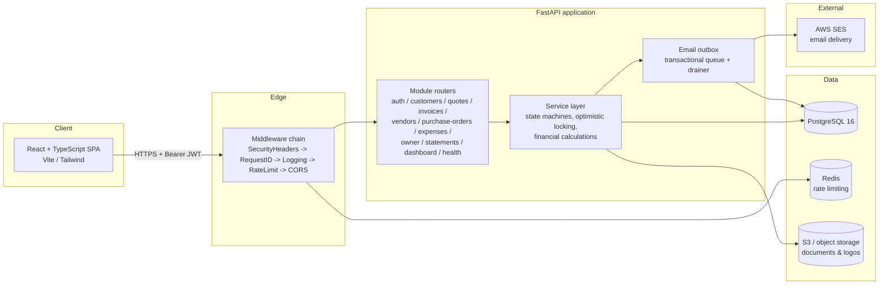
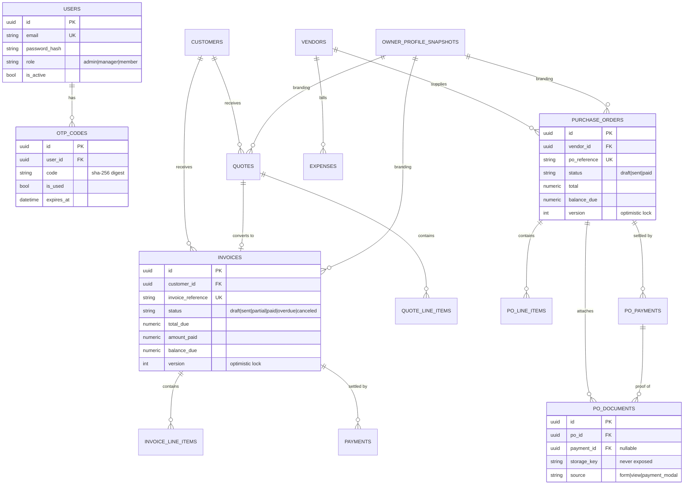
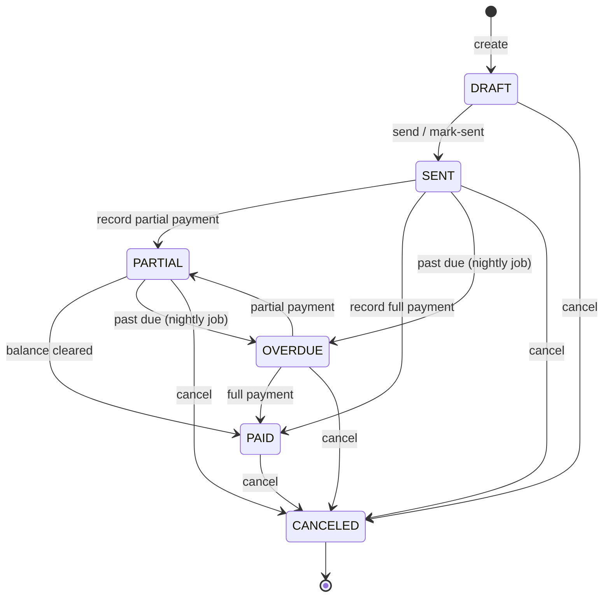
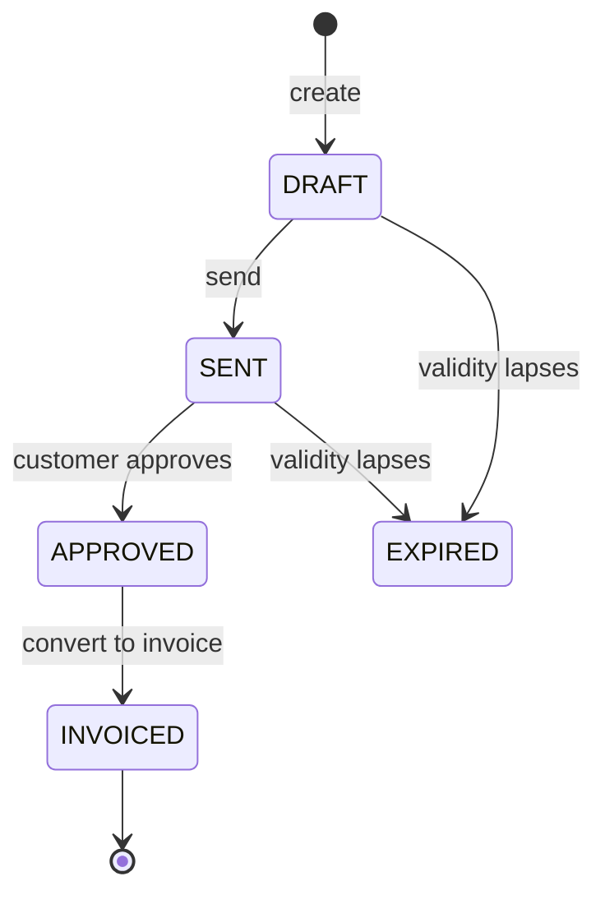
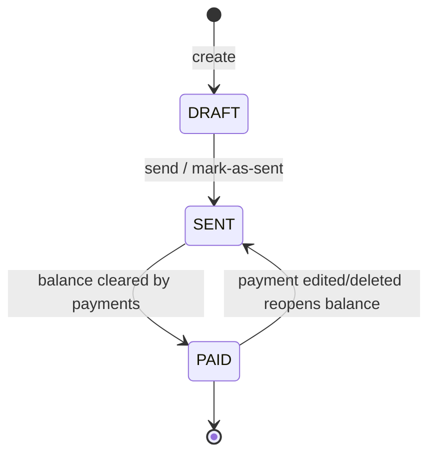

# Priori Technologies — Accounting Software

> Modern accounting & CRM platform built with FastAPI and React.

## CI / Status

[](https://gitlab.com/hah8433123/priori-crm/-/pipelines?ref=develop)
[](https://gitlab.com/hah8433123/priori-crm/-/pipelines?ref=develop)
[](https://gitlab.com/hah8433123/priori-crm/-/releases)

> Note: the GitHub Actions workflows in `.github/workflows/` are the
> authoritative pipeline. The badges above point at the GitLab mirror; swap
> the URLs for your GitHub equivalents if GitHub becomes the badge source.

## Product Overview

Priori is an enterprise CRM + accounting platform that covers the full
sales-to-cash and procure-to-pay lifecycles for a single business owner and
their team.

**Sales (receivables)**

- **Customers** — contact records, single currency per customer, running balance.
- **Quotes** — priced proposals that can be approved and converted to invoices.
- **Invoices** — issued documents with payments, partial settlement, overdue tracking, PDF generation and email delivery.

**Purchases (payables)**

- **Vendors** — supplier records.
- **Purchase Orders** — orders raised against a vendor, sent by email, settled by recorded payments, with proof-of-payment attachments.
- **Expenses** — standalone vendor-facing costs with payments and documents.

**Cross-cutting**

- **Owner profile** — company branding (logo + details) snapshotted immutably onto each issued document.
- **Dashboard & Statements** — aggregated metrics, cashflow and income statements.
- **Auth** — email + password with mandatory OTP (2FA) and role-based access control.

Key domain rules: every issued document captures an immutable owner-branding
snapshot; mutating operations use optimistic locking (`version`); financial
state transitions are guarded by per-document state machines and row locks.

## System Architecture



Requests flow through the middleware chain (registered so security headers are
outermost and the rate limiter innermost), into the module routers, down to a
service layer that owns all business rules and talks to PostgreSQL, object
storage and the transactional email outbox. Scheduled jobs (overdue
transitions, outbox drain, OTP purge) run as internal, secret-gated endpoints
triggered by scheduled pipelines.

## Entity Relationship Diagram



## Document Workflows

### Invoices

Strict state machine (`InvoiceStatus`):



- Editable only in `DRAFT`; `SENT` allows limited edits (no customer / date / currency change).
- Payments use `SELECT ... FOR UPDATE` to prevent overpayment races; recording a payment recomputes `balance_due` and the denormalized customer balance atomically.
- An immutable owner snapshot is captured the first time the invoice is issued.

### Quotes



Converting an approved quote creates a new `DRAFT` invoice and marks the quote `INVOICED`.

### Purchase Orders



- No discount, billed or canceled states in v1.
- Editable only in `DRAFT`; currency is locked after the first save.
- Settled by accumulating `PurchaseOrderPayment` records; clearing `balance_due` settles the PO to `PAID`, and editing/deleting a settling payment can reopen it to `SENT`.
- Supports proof-of-payment document attachments grouped under a payment.

All three documents share a transactional email outbox: the status change and
the queued email commit atomically, then SES dispatch runs outside the row
lock and is retried by the outbox drainer on failure.

## Authentication & Security Model

**Authentication**

- Email + password login, then a mandatory one-time passcode (OTP / 2FA) step.
- OTP codes are stored only as SHA-256 digests, are single-use, expire, and track an attempt count; pending codes are invalidated on re-issue.
- Successful OTP verification issues a short-lived access JWT and a rotating refresh token. The frontend attaches the bearer token to every request and performs a single-flight refresh on 401.
- "Remember me" controls whether tokens persist in `localStorage` (survives restarts) or `sessionStorage` (session-only).

**Authorization (RBAC)**

| Role | Capabilities |
|------|--------------|
| `admin` | Any action |
| `manager` | Destructive / financial actions (hard-delete, record payment, approve, convert, settle) |
| `member` | Ordinary create / update operations |

Privileged routes are guarded by the `require_privileged` dependency, sourced
from a single `PRIVILEGED_ROLES` set.

**Platform hardening**

- Middleware adds security headers, a request ID and timing to every response (including 429 and error paths).
- Rate limiting (Redis-backed in production) on the outer edge.
- CORS uses explicit method/header/origin allow-lists, never `*` with credentials.
- Object-storage keys are sanitized and path-confined (`sanitize_storage_key` / `resolve_safe_path`) so a crafted key can never escape the base dir or be used for arbitrary file reads; storage keys are never returned in API responses.
- Internal machine-to-machine endpoints (overdue transitions, outbox drain, OTP purge) require an `X-Internal-Secret` header and are excluded from public OpenAPI docs.
- CI runs SAST (CodeQL), dependency scanning, and secret detection (gitleaks); the GitLab mirror enforces these via scan-finding approval rules.

## Architecture

```
priori-crm/
├── api/             # Python FastAPI backend
├── frontend/        # React + TypeScript + TailwindCSS frontend
├── .github/         # GitHub Actions workflows (authoritative)
├── .gitlab-ci.yml   # GitLab CI pipeline (archived mirror)
└── docker-compose.yml
```

## Tech Stack

| Layer | Technology |
|-------|-----------|
| **Backend** | Python 3.12, FastAPI, SQLAlchemy 2.0, Alembic, Pydantic |
| **Frontend** | React 18, TypeScript, Vite, TailwindCSS, lucide-react |
| **Database** | PostgreSQL 16 |
| **Email** | AWS SES |
| **CI/CD** | GitHub Actions (`.github/workflows/`, authoritative) + GitLab CI/CD (`.gitlab-ci.yml`, archived mirror) |

## Getting Started

### Prerequisites

- Python 3.12+
- Node.js 20+
- PostgreSQL 16+ (or Docker)

### Quick Start (Docker)

```bash
docker compose up
```

- API: http://localhost:8000
- UI: http://localhost:5173
- API docs: http://localhost:8000/docs

### Manual Setup

#### API

```bash
cd api
python -m venv .venv
.venv\Scripts\activate        # Windows
pip install -r requirements.txt
alembic upgrade head
uvicorn app.main:app --reload
```

#### UI

```bash
cd frontend
npm install
npm run dev
```

### OpenAPI Schema Generation

When you add new endpoints or modify Pydantic schemas in the backend, you must regenerate the OpenAPI JSON and the frontend TypeScript types:

```bash
# 1. Export the schema from the backend (does not require a running DB)
cd api
$env:JWT_SECRET_KEY="xxxxxxxxxxxxxxxxxxxxxxxxxxxxxxxx"
$env:ENVIRONMENT="development"
$env:RATE_LIMIT_ENABLED="false"
python export_api.py ../frontend/openapi.json

# 2. Generate TypeScript types for the frontend
cd ../frontend
npx -y openapi-typescript@^7 openapi.json -o src/lib/api-schema.d.ts
```

*(Note: Use the commands above instead of `npm run gen:api` if you are on Windows, as the package.json script contains bash-specific syntax.)*

## Git Workflow

| Branch | Purpose |
|--------|---------|
| `main` | Production releases |
| `develop` | Integration branch |
| `feature/*` | New features |
| `bugfix/*` | Bug fixes |
| `hotfix/*` | Critical production fixes |
| `release/*` | Release preparation |

### Commit Convention

```
<type>(<scope>): <description>

feat(api): add customer CRUD endpoints
fix(ui): correct OTP input focus behavior
```

## Health & Monitoring

The API exposes a small, intentional set of health/uptime endpoints:

| Endpoint | Audience | Response |
|----------|----------|----------|
| `GET /api/v1/ping` | Uptime checks | `{ "ping": "pong" }` |
| `GET /api/v1/health` | Load balancers (public) | `status`, `version`, `environment`, `timestamp` |
| `GET /api/v1/health/detailed` | Internal (requires `X-Internal-Secret`) | adds `database`, `pool`, `redis` |

`GET /health` is deliberately minimal: it carries no service-name field and
no infrastructure detail (those belong on the secret-gated `/health/detailed`).
`version` is the semantic application version (`settings.APP_VERSION`).

## Continuous Integration

.github/workflows/ is the **authoritative** pipeline: it runs lint, an offline
OpenAPI contract export + generated-type check, the Postgres-guarded test
suite, and security analyzers (CodeQL SAST, dependency review, secret
detection via gitleaks) on every pull request and on `develop`/`main`.

The .gitlab-ci.yml is an **archived mirror** of the pipeline from the
original GitLab repository. It is kept for reference but is no longer
actively maintained.

## License

© 2026 Priori Technologies — All Rights Reserved

