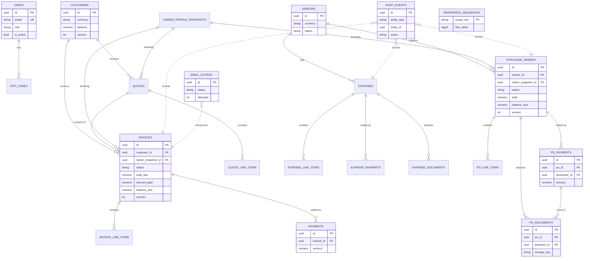

# Database & Migrations

This document describes the Business Central data model: the key tables, the
cross-cutting mechanisms (reference numbering, optimistic locking, audit
events, the transactional email outbox), the financial-document
relationships, an ERD, a review of the migration history, and a demo
seed-data walkthrough.

Backend stack: **PostgreSQL 16**, **SQLAlchemy 2.0** (declarative `Mapped`
models), **Alembic** migrations. Schema lives under `api/app/modules/*/models.py`
plus the cross-cutting models in `api/app/common/`.

---

## 1. Key tables

### Identity & access

| Table | Purpose | Notable columns |
|-------|---------|-----------------|
| `users` | Application accounts | `email` (unique), `password_hash`, `role` (`admin`/`manager`/`member`), `is_active` |
| `otp_codes` | One-time 2FA codes | `code` (SHA-256 digest, never plaintext), `is_used`, `attempt_count`, `expires_at` |

### Sales (receivables)

| Table | Purpose | Notable columns |
|-------|---------|-----------------|
| `customers` | Customer master | `customer_type`, `status`, `currency` (single currency per customer), `balance` (denormalized, `>= 0`), `version` |
| `quotes` | Sales quotations | `quote_number`/`quote_reference` (unique), `status` (`draft|sent|approved|invoiced|expired`), `related_invoice_id`, `owner_snapshot_id`, `version` |
| `quote_line_items` | Quote lines | `line_number` (unique per quote), `quantity > 0`, `line_total`, `tax_type`, `tax_amount` |
| `invoices` | Issued invoices | `invoice_number`/`invoice_reference` (unique), `status` (`draft|sent|partial|paid|overdue|canceled`), `total_due`, `amount_paid`, `balance_due` (signed), `owner_snapshot_id`, `version` |
| `invoice_line_items` | Invoice lines | same shape as quote lines |
| `payments` | Payments against an invoice | `amount > 0`, `payment_date`, `payment_method`, `reference` |

### Purchases (payables)

| Table | Purpose | Notable columns |
|-------|---------|-----------------|
| `vendors` | Vendor master | `vendor_name`, `email` (unique where not null), `currency`, `status` (`active|inactive`), `tax_id_pin`, `version` |
| `expenses` | Vendor-facing costs | `expense_number`/`expense_reference` (unique), `status` (`pending|paid|overdue|canceled`), `total_due`, `amount_paid`, `balance_due` (signed), `version` |
| `expense_line_items` / `expense_documents` / `expense_payments` | Lines, attachments, payments | payments `amount > 0`; documents carry `storage_key` (never exposed) |
| `purchase_orders` | Orders raised on a vendor | `po_number`/`po_reference` (unique), `status` (`draft|sent|paid`), `total`, `amount_paid`, `balance_due` (signed), `owner_snapshot_id`, `converted_bill_id` (no FK yet), `version` |
| `purchase_order_line_items` | PO lines | same line shape |
| `purchase_order_payments` | PO payments | `amount > 0`, optional `document_id` (proof of payment) |
| `purchase_order_documents` | PO attachments | `payment_id` (nullable; groups proof-of-payment docs under a payment), `storage_key`, `source` (`form|view|payment_modal`) |

### Branding & cross-cutting

| Table | Purpose | Notable columns |
|-------|---------|-----------------|
| `owner_profile_snapshots` | Immutable owner-branding snapshot stamped on a document at issue time | referenced by `invoices`/`quotes`/`purchase_orders.owner_snapshot_id` |
| `reference_sequences` | Monotonic high-water mark per numbering scope | `scope_key` (PK), `last_value` |
| `audit_events` | Append-only trail of financial mutations | `entity_type`, `entity_id`, `action`, `before`/`after` (JSON), `actor_id` |
| `email_outbox` | Transactional outbound-email queue | `status` (`pending|sent|failed|dead`), `attempts`, `document_type`/`document_id`, `attach_pdf` |

> Monetary columns are `NUMERIC(15, 2)`. `subtotal`, `tax_total`,
> `total*/total_due` and `amount_paid` carry `>= 0` CHECK constraints.
> `balance_due` is deliberately **unconstrained in sign**: this app records
> and reconciles payments rather than taking them, so an overpayment is a
> legitimate event and `balance_due = total - amount_paid` may be negative
> (a credit owed back). See migration `a6b7c8d9e0f1`.

---

## 2. Reference-number generation

User-facing references (`INV-000042`, `PO-20260616-001`, `EXP-...`) are
produced by `app/common/reference.py::ReferenceGenerator`, backed by the
`reference_sequences` table (`app/common/reference_sequence.py`).

Guarantees and mechanics:

- **No reuse, ever.** A naive `MAX(suffix) + 1` reuses a number after the
  most recent row is hard-deleted (the MAX drops back). `reference_sequences`
  stores the highest suffix *ever* issued per scope and is only incremented,
  so the next value is `max(table_max, high_water_mark) + 1`. Critical for a
  financial ledger.
- **Serialized generation.** Each scope is guarded by a transaction-scoped
  PostgreSQL advisory lock (`pg_advisory_xact_lock(hashtext(scope_key))`), so
  concurrent creates cannot collide on a suffix.
- **Scope key** encodes the namespace:
  - date-scoped: `"<lock_key>_<PREFIX-YYYYMMDD>"` (counter per prefix per day),
  - global: `"<lock_key>"` (single running counter).
- **Steady-state cost is constant**: once a scope row exists it is
  authoritative (`persisted + 1`), so generation no longer scans the table.
- **Belt and braces**: the unique constraint on each reference column is the
  final net; create/duplicate paths retry on a unique-reference
  `IntegrityError` inside a SAVEPOINT (`_with_reference_retry`).

---

## 3. Optimistic locking / versioning

Every mutable financial document (`invoices`, `quotes`, `expenses`,
`purchase_orders`) and the `customers`/`vendors` masters carry a
`version` integer (default `1`).

- Every mutating operation bumps `version` exactly once. The state-machine
  helper (`StateMachineMixin._transition`) owns the bump on a status change;
  non-transition writes bump it directly.
- Update endpoints accept an `expected_version`; `assert_version` locks the
  row and compares under the lock, so a concurrent edit conflicts with a
  `409` instead of silently overwriting (last-writer-wins is prevented).
- Status transitions and payment recording load the row
  `SELECT ... FOR UPDATE` (`_get_locked`) so concurrent payments serialize on
  the row lock rather than racing (the race-condition contract).

---

## 4. Audit events

`app/common/audit.py::AuditEvent` is an **append-only** trail. Application
code never updates or deletes rows here.

- Written by `record_audit_event(...)` for every financially significant
  mutation: `payment_recorded`, `payment_updated`, `payment_deleted`,
  `canceled`, `marked_sent`, `soft_deleted`, `hard_deleted`, etc.
- **Flush-only, never commits**: the row is written in the *same* transaction
  as the audited mutation, so the caller's commit/rollback governs both. A
  rolled-back payment leaves no phantom audit row; a committed one always has
  its trail.
- `before`/`after` are JSON snapshots. Indexed by
  `(entity_type, entity_id, created_at)` for "everything that happened to X".

---

## 5. Email outbox (transactional)

`app/common/email_outbox.py::EmailOutbox` implements the transactional-outbox
pattern so a document email is never lost.

- The outbox row is enqueued in the **same transaction** as the state change
  it announces (e.g. invoice `DRAFT -> SENT`). Commit makes both durable
  together.
- Lifecycle: `pending -> sent` | `failed -> ... -> dead` after
  `MAX_DELIVERY_ATTEMPTS` (5).
- `deliver_now` is a best-effort synchronous send right after the locked send
  phase commits (keeps the happy path snappy); on failure the row stays
  queued.
- `drain` (`POST /internal/email-outbox/drain`, `X-Internal-Secret`) retries
  pending/failed rows and is invoked by an external scheduler.
- **PDF attachments are rendered at delivery time** from
  `document_type` + `document_id`, so the locked send phase does no PDF work
  and every retry attaches fresh bytes.

---

## 6. Financial document relationships

- **Customer -> Quote / Invoice**: a customer transacts in a single currency;
  `customers.balance` is a denormalized rollup of outstanding invoice
  `balance_due`, resynced after each payment/transition and **clamped at 0**
  (a per-invoice overpayment shows as that invoice's negative `balance_due`,
  not a negative account balance).
- **Quote -> Invoice**: an `approved` quote converts to a new `draft`
  invoice; the quote is stamped `invoiced` and links via
  `quotes.related_invoice_id`.
- **Vendor -> Expense / Purchase Order**: vendor payables are computed at
  query time (never stored on the vendor).
- **Payments**: `payments` (invoices), `expense_payments`, and
  `purchase_order_payments` accumulate against their parent. Recording a
  payment advances `amount_paid` and recomputes `balance_due = total -
  amount_paid`. Settlement to `PAID` triggers on `balance_due <= 0`; further
  payments on a settled document are recorded idempotently and drive
  `balance_due` further negative.
- **Owner snapshot**: the first time a document is issued (sent), an
  immutable `owner_profile_snapshots` row is captured and referenced, so
  editing the live owner profile can never re-brand an already-issued
  document.
- **PO documents <-> PO payments**: `purchase_order_documents.payment_id` and
  `purchase_order_payments.document_id` form a deliberate mutual cycle (the
  FK is deferred via `use_alter`) so a payment can carry several
  proof-of-payment documents.

---

## 7. Entity Relationship Diagram



### Regenerating the ERD

The diagram above is maintained by hand from the ORM models. To regenerate a
full ERD from the live database or from SQLAlchemy metadata:

```bash
# From the live PostgreSQL schema (requires Graphviz):
pip install eralchemy2
eralchemy2 -i "$DATABASE_URL" -o docs/erd.svg

# Or from SQLAlchemy metadata without a database, after importing the models
# so every table is registered on Base.metadata:
python - <<'PY'
from eralchemy2 import render_er
import app.main          # noqa: F401  (imports all models onto Base.metadata)
from app.common.database import Base
render_er(Base.metadata, "docs/erd.svg")
PY
```

---

## 8. Migration history review

The history under `api/alembic/versions/` is long and intentionally
append-only: **every migration reflects real schema history and should be
kept**. Reverting or squashing them would diverge already-migrated
environments. The points below are documentation, not a call to delete.

### Correction / duplicate-looking migrations (kept on purpose)

- **Two `add_invoices_module` migrations** — `d11efcf55108` (2026-05-15) and
  `eb7d085d46e2` (2026-05-22). The first introduced the module; the second
  reworked it as the model matured. Both are real history.
- **Two `correct_invoices_module` migrations** with identical titles —
  `0d9abce6f17f` (2026-05-23 07:38) and `683d60a50164` (2026-05-23 11:22).
  Both drop and recreate `ix_customers_fulltext_search`. They are genuine
  successive corrections of the GIN full-text index expression made the same
  day; the second supersedes the first. Kept because environments that ran
  only the first must still apply the second to converge.
- **Reused human-revision label `c9d0e1f2a3b4`** appears on two *different*
  files: `2026_06_11_1500-..._add_customer_version.py` and
  `2026_06_16_1300-..._add_purchase_orders_module.py`. Alembic keys on the
  internal `revision`/`down_revision` identifiers (which are distinct and
  form a valid linear chain), so this is only a confusing filename slug, not
  a real collision. **Do not rename** the applied revisions; treat the slug
  as cosmetic.

### Conventions going forward

- One logical change per migration; name it for the change
  (`allow_overpayment_drop_balance_checks`), not the module.
- Make destructive constraint drops idempotent (`DROP CONSTRAINT IF EXISTS`)
  so they are safe against the `create_all` test schema, and provide a
  reversible `downgrade` (clamp data first if re-adding a constraint).
- The test suite builds the schema with `Base.metadata.create_all` (see
  `conftest.py`), so model `CheckConstraint`s must stay in lockstep with the
  migrations or tests and production will disagree.

### Linear chain (latest first)

`a6b7c8d9e0f1` (allow overpayment) -> `f5a6b7c8d9e0` (PO document payment_id)
-> `e4f5a6b7c8d9` (PO drop billed/canceled) -> `d3e4f5a6b7c8` (PO payments &
balance) -> `c2d3e4f5a6b7` (PO status add paid) -> `b1c2d3e4f5a6` (owner
settings) -> `c9d0e1f2a3b4` (PO module) -> ... -> `0001` (initial).

---

## 9. Demo seed data

`api/scripts/seed_demo.py` populates a complete, self-consistent demo:
owner profile, one customer, one vendor, a quote, an invoice (with a
payment), a purchase order (with a payment), and exercises the statement
endpoints. It is **idempotent** (safe to re-run) and refuses to run unless
`ENVIRONMENT` is `development`.

```bash
cd api
# requires the same env as the app (DATABASE_URL, JWT_SECRET_KEY, ...)
alembic upgrade head
python -m scripts.seed_demo
```

What it creates, in dependency order:

1. **Owner profile** — company name, address, branding defaults.
2. **Customer** — one active business customer (KES).
3. **Vendor** — one active vendor (KES).
4. **Quote** — a `draft` quote for the customer, then marked `approved`.
5. **Invoice** — converted from the quote (or created directly), marked
   `sent`, then a partial **payment** recorded (status -> `partial`).
6. **Purchase order** — a `draft` PO for the vendor, marked `sent`, then a
   **payment** recorded.
7. **Statement** — the script prints the customer statement / income +
   cashflow summary so the demo data is immediately visible end-to-end.

See the module docstring in `api/scripts/seed_demo.py` for the exact records
and for the overpayment demo (recording an extra payment to show a negative
`balance_due`).
