# Deployment pipeline — design review

How `develop` reaches **staging.crm.priori.co.ke** automatically, and how `main`
reaches **accounting.priori.co.ke** behind an approval gate.

> **Status:** the repository side is **implemented** (§9 phases 1–7 — workflows,
> the Passenger shim, and the release scripts are all in the tree). It is **not yet
> live**: every item in §7 is infrastructure work outside this repo, and until those
> are done `deploy-staging.yml` will fail at the SSH step. §3 explains the defects
> and platform limits the implementation works around.
>
> **Pipeline host: GitHub Actions. Source of truth: GitLab.** GitLab push-mirrors to
> GitHub and force-updates `develop` and `main`, so GitHub is a replica that runs the
> deploys. **Merge on GitLab** — the mirror then pushes to GitHub, which is what
> triggers the deploy. `.gitlab-ci.yml` keeps gating merges on the GitLab side and is
> not modified by this design.
>
> Environment facts were probed live on **2026-08-16**; probe commands are shown so
> they can be re-run when they go stale.

---

## 1. What is actually running today

| | Staging | Production |
|---|---|---|
| Host | `69.72.248.125` — MochaHost shared cPanel | `164.90.218.101` — DigitalOcean droplet |
| Web server | LiteSpeed | nginx/1.24.0 (Ubuntu) |
| Current state | **HTTP 404 — nothing deployed** | **Live**, `/` serves the SPA, `/api/v1/health` returns `{"status":"healthy","environment":"production"}` |
| Origin model | same-origin (§4.1) | **same-origin**: nginx serves `dist` at `/`, proxies `/api` to the API |
| SSH (22) | **Open** — `SSH-2.0-OpenSSH_9.9` | Open |
| API runtime | *(none yet)* | systemd + venv, **uvicorn** (no `gunicorn` in `api/requirements.txt`) |
| Deploys today | none | manual — `index.html` `Last-Modified: 2026-08-14` |

**The old MochaHost runbook is stale.** `docs/technical/mochahost-deployment.md` on
branch `duo/chore/mochahost-staging-deploy` (commit `e2837b7e`) documents ports 21 and
22 as *filtered at the host's network edge* and builds an elaborate SSH-free cPanel
path around that. **That block has been lifted** — port 22 answers with an OpenSSH 9.9
banner today, so ordinary rsync-over-SSH works. That commit also targets a different
application layout (`backend/` + a Next.js `web/`), so its files do not port to this
repo; only two of its ideas do (the Passenger WSGI shim, and cron-instead-of-daemon).

Re-run the probes:

```bash
for h in staging.crm.priori.co.ke accounting.priori.co.ke; do nslookup $h; done
curl -sSkI https://staging.crm.priori.co.ke | head -3
curl -sSk  https://accounting.priori.co.ke/api/v1/health
```

---

## 2. Target pipeline

```mermaid
flowchart TD
    subgraph dev ["push / merge to develop — fully automatic"]
        A0[["deploy-staging.yml"]] --> A1[api-ci]
        A0 --> A2[ui-ci]
        A0 --> A3[security]
        A1 --> A4[deploy job]
        A2 --> A4
        A3 --> A4
        A4 --> A5[build SPA<br/>VITE_API_BASE_URL = staging]
        A5 --> A6[rsync + migrate + Passenger restart]
        A6 --> A7[smoke: /api/v1/health]
    end

    subgraph prod ["main — human-triggered"]
        B0{{"maintainer runs deploy-production.yml<br/>types 'deploy' to confirm"}} --> B1[guard: ref is main]
        B1 --> B2[api-ci]
        B1 --> B3[ui-ci]
        B1 --> B4[security]
        B2 --> B5[deploy job]
        B3 --> B5
        B4 --> B5
        B5 --> B6[pg_dump backup]
        B6 --> B7[alembic upgrade head]
        B7 --> B8[symlink swap + systemctl restart]
        B8 --> B9[smoke: /api/v1/health]
        B9 -->|fail| B10[auto-rollback: repoint symlink]
    end
```



Two new workflows, and the three existing ones become **reusable** (§3.1):

| File | Trigger | Role |
|---|---|---|
| `deploy-staging.yml` | *new* — `push` on `develop` | runs the full suite, then deploys |
| `deploy-production.yml` | *new* — `workflow_dispatch` | the approval gate, then the full suite, then deploys |
| `api-ci.yml`, `ui-ci.yml`, `security.yml` | existing + `workflow_call` | unchanged as CI; now callable by the deploy workflows |

What "security is green" means on the deploy path: `security.yml`'s **secret
detection** (gitleaks over the full history) gates deploys. Its **dependency scan**
(pip-audit + npm audit) gates merges only — it is skipped when a deploy workflow
calls the workflow, deliberately, because an advisory database moves without anyone
committing and a deploy must not become impossible at a moment nobody chose (§3.8).
So the PR check is the stricter of the two, which is the right way round.

Python SAST is not a third job here: it rides in `api-ci.yml`'s `lint`, which the
deploy workflows already call, via ruff's flake8-bandit (`S`) ruleset. Deep dataflow
analysis for both languages stays on the GitLab mirror. §3.8 explains why the
GitHub-native scanners were replaced.

---

## 3. Defects and platform limits

### 3.1 `paths:` filters mean "CI passed" can be vacuous — call the workflows, don't trust them

`api-ci.yml` and `ui-ci.yml` are both path-filtered:

```yaml
on:
  push:
    branches: [main, develop]
    paths: ["api/**", ".github/workflows/api-ci.yml"]
```

A frontend-only merge to `develop` means **`api-ci.yml` never runs at all**. Any deploy
design that waits for those workflows to be green then has to treat "never ran" as
either success (deploys untested code) or failure (blocks every partial change). Both
are wrong. `security.yml`, to its credit, has no `paths:` filter and always runs.

**Fix: the deploy workflow calls CI as reusable workflows** rather than observing it.
Add `workflow_call:` to the `on:` block of all three, then:

```yaml
# .github/workflows/deploy-staging.yml
name: Deploy staging

on:
  push:
    branches: [develop]     # deliberately NO paths: filter

concurrency:
  group: deploy-staging     # never two staging deploys at once
  cancel-in-progress: false

# A called workflow only gets what the caller grants, and download-artifact needs
# actions: read — without this block it fails whenever the repo's default token is
# read-only. security.yml itself needs nothing beyond contents: read (§3.8).
permissions:
  contents: read
  actions: read

jobs:
  api-ci:
    uses: ./.github/workflows/api-ci.yml
    secrets: inherit
  ui-ci:
    uses: ./.github/workflows/ui-ci.yml
    secrets: inherit
  security:
    uses: ./.github/workflows/security.yml
    secrets: inherit

  deploy:
    needs: [api-ci, ui-ci, security]   # all three must be green
    runs-on: ubuntu-latest
    # ... §4.6
```

**A queueing caveat worth knowing before it confuses someone.** `cancel-in-progress:
false` queues rather than cancels, but GitHub only holds **one** run in the queue: if
merges A, B and C land in quick succession, A deploys, B waits, and C *evicts* B. B
shows as cancelled, not failed. Under an rsync deploy the outcome is harmless — C is
newer and includes B's commits — but the signal reads as "B never reached staging".
This is documented GitHub behaviour, not something the YAML can fix; it is only a
problem if someone is watching for a specific commit's deploy to go green.

This runs the entire suite on every deploying commit regardless of which paths
changed, and puts CI and the deploy in one run, so the tests provably ran against the
exact SHA being shipped.

### 3.2 `VITE_API_BASE_URL` is baked at build time

```ts
// frontend/src/lib/constants.ts:1-2
const API_BASE_URL = import.meta.env.VITE_API_BASE_URL;
export const API_URL = API_BASE_URL + "/api/v1/";
```

- **Build once per environment.** There is no promote-the-artifact path; staging and
  production bundles are different bytes. What gets promoted is the *commit*.
- **Unset fails silently and late.** Missing, the concatenation yields the literal
  string `"undefined/api/v1/"` — build green, lint green, every request 404s at
  runtime. Assert it: `test -n "$VITE_API_BASE_URL"`.
- **`VITE_*` ships to the browser.** Never put a secret behind that prefix.

### 3.3 The approval gate is not available as a GitHub feature on this repo

`benson-priori/priori-crm` is **private**, on a plan without the paid protection
features. Verified:

```console
$ gh api repos/benson-priori/priori-crm/branches/main/protection
Upgrade to GitHub Pro or make this repository public to enable this feature. (HTTP 403)
```

So the two obvious mechanisms are both off the table:

- **Branch protection** on `main` — 403 as above.
- **Environment protection rules / required reviewers** — documented as GitHub Pro,
  Team or Enterprise for private repositories. The `Production` environment that
  already exists reports `protection_rules: []`.

**The gate is therefore `workflow_dispatch`:** production never deploys on a push. A
maintainer opens Actions → *Deploy production* → Run workflow, and types `deploy` to
confirm. That is a real gate — nothing reaches production without a deliberate human
act — but be precise about what it is and is not:

| | `workflow_dispatch` (this design) | Environment required-reviewers (Pro) |
|---|---|---|
| Human must act before deploy | yes | yes |
| Approver can be someone *other* than the triggerer | **no** | yes |
| Audit trail | run history shows who triggered | approval record per deployment |
| Restricts *who* | anyone with write access | named reviewers only |

If genuine four-eyes approval is a requirement rather than a nice-to-have, **GitHub
Pro is the cheap fix** — it unlocks both branch protection on `main` and required
reviewers on the `Production` environment, and the workflow below changes by about
four lines. Worth pricing before building around the limitation permanently.

### 3.4 Vercel is still connected — this is live, not hypothetical

The repo's environment list is Vercel's:

```console
$ gh api repos/benson-priori/priori-crm/environments --jq '.environments[].name'
Preview
Preview – priori-crm
Preview – priori-crm-ou38
Preview – priori-crm-zluj
Production
Production – priori-crm
...
```

That is **three Vercel projects** attached to this repository, each of which will
auto-deploy on the same pushes the new pipeline responds to. Disconnect all three in
the Vercel dashboard (and confirm Render likewise) before enabling
`deploy-staging.yml`, or every merge to `develop` will trigger competing deploys. The
`vercel.json` / `render.yaml` files can stay in the repo — the *project connections*
are the problem, not the files.

### 3.5 Delete the `openapi.json` commit-back step

`ui-ci.yml` currently commits the regenerated schema back to `develop`/`main`, with a
retry loop and `contents: write`. Its stated reason is Vercel:

> On push to main/develop, commit the regenerated schema back so the Vercel deploy
> always has a fresh contract with no manual step.

With Vercel disconnected (§3.4) that reason is gone, and the step becomes pure
liability: a bot push racing the deploy, a rebase-retry loop that can fail the
workflow, and write permission on a workflow that otherwise needs none.

**Remove *only* the `Commit updated schema` step, and drop `permissions: contents:
write` from that job. Leave the `Upload schema artifact` step exactly as it is.**

That precision matters — both steps live in the same `openapi-schema` job, and it is
natural to delete the job's whole write-path at once. The upload is **load-bearing**:
`deploy-staging.yml` and `deploy-production.yml` both `download-artifact` that
`openapi-schema` artifact to build the SPA against a contract exported from the very
commit being deployed (§4.6). Delete the upload and both deploys break at the download
step.

Nothing is lost by dropping the commit-back: building from the artifact is strictly
stronger than reading a committed file that may lag the code.

### 3.6 Migrations must be a discrete, loud step

`api/Dockerfile` ends with `alembic upgrade head && uvicorn ...`. Coupling migration
to process start makes a failed migration look like a crash-looping service instead of
a failed deploy. On the droplet, run the migration as its own step, **after** a
`pg_dump`, and fail the deploy there — before anything restarts.

---

### 3.7 CI used to run twice on every push to `develop` — fixed

`api-ci.yml`, `ui-ci.yml` and `security.yml` each carried
`push: branches: [main, develop]` while `deploy-staging.yml` *also* calls all three,
so every merge to `develop` ran the full suite twice — once standalone, once inside
the deploy run. On a private repository those are billed minutes, and Actions billing
is what stopped the first deploy that got past the security gate.

`develop` is now dropped from the three `push:` triggers:

```yaml
# api-ci.yml, ui-ci.yml, security.yml
on:
  push:
    branches: [main]      # deploy-staging.yml covers develop
```

Nothing is lost. Pull requests into `develop` still run the full suite via the
untouched `pull_request:` triggers, and every push to `develop` runs it via
`deploy-staging.yml` — against the exact commit being deployed, which is the stronger
signal of the two.

### 3.8 CodeQL and dependency review need Advanced Security — the deploy gate could never go green

Discovered when PR #45's own checks were reviewed. Two of `security.yml`'s three jobs
failed on every single run, and not for anything in the code:

```
CodeQL             Code scanning is not enabled for this repository.
                   Please enable code scanning in the repository settings.
Dependency review  Dependency review is not supported on this repository.
                   Please ensure that Dependency graph is enabled along with
                   GitHub Advanced Security
```

Both need GitHub Advanced Security, which a **private repository on the free plan**
does not have — the same wall as §3.3, where reading branch protection returns
`Upgrade to GitHub Pro or make this repository public`.

This mattered far more than a red column on a PR. Both deploy workflows gate on
`needs: [api-ci, ui-ci, security]`, so a job that can never succeed meant **no push to
`develop` could ever reach staging and no dispatch could ever reach production**. The
pipeline would have merged looking complete and shipped nothing.

Making the repository public would clear the wall, and it was considered and rejected:
the runbooks name hosts, SSH users and absolute paths, the git history is exposed in
full and permanently once published, and ADR-0012's risk thresholds only deter an
attacker who cannot read them. So the two jobs were replaced with equivalents that run
anywhere:

| Was | Now | Note |
|---|---|---|
| CodeQL (SAST) | ruff `S` in `api-ci` lint; GitLab SAST for depth | Checked against bandit: 0 high, 1 documented false positive |
| Dependency review | `pip-audit` + `npm audit --audit-level=high` | Gates merges, not deploys — see below |
| `gitleaks-action` | pinned `gitleaks` binary, checksum-verified | The action 403'd on `/pulls/{n}/commits`; the binary needs no token |

Neither `continue-on-error` nor an `if:` skip would have done for the *replacement*.
A skipped job satisfies nothing if branch protection ever becomes available, and a
permanently-red check trains everyone to stop reading the column.

**The dependency scan gates merges, not deploys** — and that is the same lesson
applied once more rather than an exception to it. Advisory databases move on their
own: a CVE published against an unchanged transitive dependency turns `pip-audit` or
`npm audit` red with no commit involved. Gating deploys on that makes production
unshippable at a moment nobody chose, including the moment a hotfix is needed. It is
the defect this section exists to remove, only stochastic instead of permanent, and
`ecdsa` shows it is not hypothetical — a high-severity advisory with no fix available
is already in the tree today.

Nothing is given up by the split. A deploy ships the exact dependency set that
already passed on the pull request; only the database changed in between, and the
answer to a new advisory is a dependency bump on a branch, not a blocked release.
Secret detection still gates deploys, because it can only fail on something actually
present in the commits being shipped.

Mechanically, `dependency-scan` carries `if: ${{ !inputs.deploy_gate }}` against a
`workflow_call` input defaulting to `true`. `inputs` is null under `push` and
`pull_request` and populated on a call, which is the only reliable way to tell the
two apart: `github.event_name` inside a called workflow reports the *caller's* event,
so a deploy triggered by a push to `develop` looks exactly like CI on `develop`.
Passing `deploy_gate: false` forces the scan on a called run if that is ever wanted.

Clearing the new scanners took real dependency work, not just wiring: six high npm
advisories (`postcss`, `react-router`, `nanoid` — all fixed within existing semver
ranges, lockfile only) and four Python ones (`python-multipart` → 0.0.31,
`pydantic-settings` → 2.14.2). One Python finding has no fix and is ignored by ID with
the reasoning recorded in `api/requirements.txt`: PYSEC-2026-1325, the Minerva timing
side-channel in `ecdsa`, unreachable because `JWT_ALGORITHM` is HS256 and no EC key is
ever signed with.

The first successful gitleaks run over the full history — 2,853 commits — found twelve
matches, all reviewed and none live: throwaway CI signing keys (the current ones now
carry inline `# gitleaks:allow`) and test fixture constants. They are retired by
fingerprint in `.gitleaksignore`, one comment per group explaining why. History is
scanned rather than just the tip, because a secret committed and later deleted is
still there for anyone who clones.

---

## 4. Staging — MochaHost (cPanel / LiteSpeed / Passenger)

Staging runs the **full stack**: SPA, FastAPI, and its own Postgres.

### 4.1 Same-origin works — no `api.staging` subdomain needed

The question was whether staging can work the same way the droplet does: SPA at `/`
and API at `/api/v1/...` on **one** hostname. It can, with one caveat, and the caveat
is a single environment variable.

Passenger mounts a Python app under a base URI and passes the remainder as
`PATH_INFO` — so with the app mounted at `/api`, a request for `/api/v1/health`
arrives as `SCRIPT_NAME=/api`, `PATH_INFO=/v1/health`. Whether FastAPI still matches
its routes depends on how the WSGI shim and Starlette's router handle that split,
which is version-specific and not worth guessing. Tested against this repo's actual
versions (fastapi 0.136.1, starlette 1.6.0, a2wsgi 1.10.10):

| Case | `API_V1_PREFIX` | `SCRIPT_NAME` | `PATH_INFO` | Result |
|---|---|---|---|---|
| Control — root mount, production config | `/api/v1` | *(none)* | `/api/v1/health` | **200 OK** |
| Sub-URI mount, prefix unchanged | `/api/v1` | `/api` | `/v1/health` | **404 Not Found** |
| Sub-URI mount, `API_V1_PREFIX=/v1` | `/v1` | `/api` | `/v1/health` | **200 OK** |

Starlette strips the mount prefix before matching, so leaving `API_V1_PREFIX` at
`/api/v1` under a `/api` mount looks for `/api/v1/api/v1/health` and 404s. Setting
`API_V1_PREFIX=/v1` on staging cancels the strip exactly.

**Net effect — the externally visible surface is identical to production:**

| | Staging | Production |
|---|---|---|
| Health URL | `https://staging.crm.priori.co.ke/api/v1/health` | `https://accounting.priori.co.ke/api/v1/health` |
| `VITE_API_BASE_URL` | `https://staging.crm.priori.co.ke` | `https://accounting.priori.co.ke` |
| Cross-origin? | no | no |
| `CORS_ORIGINS` relevant? | no | no |
| `API_V1_PREFIX` | `/v1` ← **only difference** | `/api/v1` |

Every URL the browser, the frontend bundle and the scheduled internal jobs use is the
same shape in both environments. The difference is one internal variable compensating
for Passenger's mount semantics — it is not a routing difference the application or
its clients can observe. `API_V1_PREFIX` is a real settings field
(`api/app/lib/config.py:21`, consumed at `api/app/main.py:154`), so this is
configuration, not a patch.

**So: do not create `api.staging.crm.priori.co.ke`.** The subdomain was only needed to
dodge the sub-URI question, and the answer turned out to be workable. This also keeps
staging free of the cross-origin/CORS divergence that a split-domain staging would
have introduced.

**Confirmed end-to-end against the real application.** The matrix above uses a
synthetic app; `api/passenger_wsgi.py` was then exercised with the actual
`app.main:app`, `ENVIRONMENT=staging` and `API_V1_PREFIX=/v1`, called the way
Passenger calls it:

```
public URL                             SCRIPT_NAME  PATH_INFO    result
https://staging.../api/v1/health       /api         /v1/health   200 {"status":"healthy","environment":"staging"}
https://staging.../api/v1/ping         /api         /v1/ping     200 {"ping":"pong"}
```

The request logs emitted `"path": "/api/v1/health"` — a2wsgi reconstructs the full
public path for logging while Starlette matches the stripped one, so log lines and
the middleware's request records stay directly comparable with production's.

Two things still to verify on the host, since the above is Passenger's calling
convention rather than Passenger itself:

1. After deploying, `curl https://staging.crm.priori.co.ke/api/v1/health` returns
   `{"status":"healthy"}`. If it 404s, print `SCRIPT_NAME`/`PATH_INFO` from
   `passenger_wsgi.py` and compare against the table.
2. FastAPI's generated docs and `openapi.json` sit at the app root, so they land at
   `/api/docs` and `/api/openapi.json` on staging. Harmless — nothing consumes them at
   runtime (the frontend builds types from the CI-exported schema).

### 4.2 Layout on the host

```
~/staging.crm.priori.co.ke/          # docroot — SPA dist + .htaccess
~/apps/priori-api/                   # cPanel Python App root, Application URL = /api
    passenger_wsgi.py                # new — ASGI→WSGI shim
    app/ alembic/ requirements.txt   # rsync'd from api/
    tmp/restart.txt                  # touch to restart Passenger
~/virtualenv/apps/priori-api/3.12/   # cPanel-managed venv
```

**`api/passenger_wsgi.py`** (new) — Passenger requires a WSGI callable and FastAPI is
ASGI-only:

```python
from a2wsgi import ASGIMiddleware
from app.main import app as asgi_app

application = ASGIMiddleware(asgi_app)
```

This adds **`a2wsgi` to `api/requirements.txt`**, a runtime dependency that exists
solely for the staging host; production never imports it.

**SPA fallback `.htaccess`** in the docroot. The `!^/api` guard is essential — without
it the fallback swallows API requests and serves them `index.html`:

```apache
RewriteEngine On

# Never let the SPA fallback intercept the Passenger-mounted API.
RewriteCond %{REQUEST_URI} ^/api
RewriteRule ^ - [L]

# Real files and directories serve as-is.
RewriteCond %{REQUEST_FILENAME} -f [OR]
RewriteCond %{REQUEST_FILENAME} -d
RewriteRule ^ - [L]

# Everything else is a client-side route.
RewriteRule ^ index.html [L]
```

### 4.3 Build in CI, never on the shared host

The frontend is built in the GitHub runner; only `dist/` ships. Shared cPanel gives a
constrained CPU/memory slice and this project has already been bitten by build
resource limits (`duo/fix/next-build-cpu-cap`). The host receives static files and
Python source only.

### 4.4 Background jobs — reuse what exists

Shared hosting cannot keep a daemon alive, and nothing new needs building:
`.github/workflows/scheduled-jobs.yml` already implements the internal-job caller
(outbox drain every 5 min, nightly transitions) driven by `API_BASE_URL` and
`INTERNAL_API_SECRET`.

It runs a per-environment matrix (production + staging). The staging leg skips with
a notice while `STAGING_API_BASE_URL` / `STAGING_INTERNAL_API_SECRET` are unset, so
the every-5-minutes schedule is not red before staging exists; the production leg
fails loudly on missing secrets — that is the alert. cPanel Cron Jobs are the
fallback if the schedule should not depend on GitHub.

### 4.5 Postgres extensions — resolved, not a blocker

> **Settled 2026-08-16 against the real host.** Neither extension is installable
> there (`postgresql-contrib` is absent, PostgreSQL 13.23), and neither blocks the
> deploy. `pgcrypto` is never created by a migration and is unnecessary —
> `gen_random_uuid()` is core from PG 13 and nothing calls a pgcrypto-only function.
> `pg_trgm` is now guarded on `pg_available_extensions` in both migrations that use
> it, so the chain migrates through and only the trigram search indexes are skipped;
> `deploy/enable_trgm_indexes.sql` adds them later if contrib ever lands. CI and the
> production droplet install the extension and are unaffected.
>
> The original assessment, kept because it is why the check comes first:

The schema depends on **`pg_trgm`** (trigram indexes) and **`pgcrypto`**
(`gen_random_uuid()` defaults); both CI configs create them explicitly before tests.
`CREATE EXTENSION` normally requires superuser, which a shared cPanel Postgres role
usually is not — and the `duo/fix/pgcrypto-optional` branch suggests this has been hit
before.

**Verify before committing to full-stack staging.** In phpPgAdmin, against the staging
database:

```sql
CREATE EXTENSION IF NOT EXISTS pg_trgm;
CREATE EXTENSION IF NOT EXISTS pgcrypto;
```

If either is refused: ask MochaHost support to install them (usually granted), or move
staging's database to a managed Postgres. This is the one item that can invalidate §4,
so do it first.

### 4.6 The staging deploy job

```yaml
  deploy:
    needs: [api-ci, ui-ci, security]
    runs-on: ubuntu-latest
    environment:
      name: staging
      url: https://staging.crm.priori.co.ke
    env:
      VITE_API_BASE_URL: https://staging.crm.priori.co.ke
    steps:
      - uses: actions/checkout@v4

      - uses: actions/setup-node@v4
        with:
          node-version: "20"
          cache: npm
          cache-dependency-path: frontend/package-lock.json

      # Contract exported from THIS commit by ui-ci, not the committed copy (§3.5).
      - uses: actions/download-artifact@v4
        with:
          name: openapi-schema
          path: frontend

      - name: Build SPA
        working-directory: frontend
        env:
          VITE_OPENAPI_SCHEMA: ${{ github.workspace }}/frontend/openapi.json
        run: |
          test -n "$VITE_API_BASE_URL" || { echo "VITE_API_BASE_URL unset"; exit 1; }
          npm ci
          npm run build
          test -f dist/index.html

      # Secrets go through env:, never string-interpolated into the script body.
      - name: Configure SSH
        env:
          SSH_KEY: ${{ secrets.STAGING_SSH_KEY }}
          KNOWN_HOSTS: ${{ secrets.STAGING_KNOWN_HOSTS }}
        run: |
          mkdir -p ~/.ssh && chmod 700 ~/.ssh
          printf '%s\n' "$SSH_KEY" > ~/.ssh/id_ed25519
          chmod 600 ~/.ssh/id_ed25519
          printf '%s\n' "$KNOWN_HOSTS" > ~/.ssh/known_hosts

      # Abridged — .github/workflows/deploy-staging.yml is authoritative. The
      # real file additionally validates STAGING_SSH_USER/HOST and requires
      # STAGING_DOCROOT / STAGING_APP_DIR to be nonempty absolute paths BEFORE
      # arming any rsync --delete (an empty docroot would otherwise make the
      # destination "$SSH_TARGET:/"), and carries the full exclude lists.
      #
      # Order matters: API first, SPA cutover last. The SPA rsync is the only
      # user-visible change, so it must not run until API upload + install +
      # migrate + restart have all succeeded — otherwise a failed API deploy
      # leaves staging serving a new frontend against the old API.
      - name: Deploy
        env:
          SSH_TARGET: ${{ secrets.STAGING_SSH_USER }}@${{ secrets.STAGING_SSH_HOST }}
        run: |
          rsync -az --delete --exclude '.env' --exclude 'uploads/' \
                --exclude '__pycache__' api/ "$SSH_TARGET:$APP_DIR/"
          rsync -az deploy/enable_trgm_indexes.sql "$SSH_TARGET:$APP_DIR/deploy/"
          ssh "$SSH_TARGET" "APP_DIR='$APP_DIR' bash -s" < deploy/staging_release.sh
          rsync -az --delete --exclude '.htaccess' --exclude 'api/' \
                --exclude '.well-known/' --exclude 'cgi-bin/' \
                frontend/dist/ "$SSH_TARGET:$DOCROOT/"
          rsync -az deploy/staging.htaccess "$SSH_TARGET:$DOCROOT/.htaccess"

      - name: Smoke test
        run: |
          for i in $(seq 1 30); do
            curl -fsS https://staging.crm.priori.co.ke/api/v1/health \
              | grep -q '"status":"healthy"' && exit 0
            sleep 2
          done
          echo "staging health check never passed"; exit 1
```

`deploy/staging_release.sh` — kept in the repo so it is reviewable:

```bash
set -euo pipefail
source ~/virtualenv/apps/priori-api/3.12/bin/activate
cd ~/apps/priori-api
pip install --upgrade -r requirements.txt
alembic upgrade head
mkdir -p tmp && touch tmp/restart.txt   # Passenger reloads on this
```

**Expand/contract applies to staging too.** `alembic upgrade head` runs while the
OLD code is still serving — Passenger reloads only after `tmp/restart.txt` is
touched, and lazily, on the next request after that. A migration the previous
release cannot run against therefore breaks staging for the window between the
migration and the reload (and indefinitely if the deploy fails in between). Write
migrations the same way §5.3 demands for production: add nullable, backfill,
contract a release later. Staging is the rehearsal for exactly that discipline.

**What the smoke test does and does not prove.** The health check verifies the
service is alive, not that the new commit is the one serving — the `version` field
in the payload is the static `APP_VERSION`, not a build stamp, and Passenger's lazy
reload makes a brief stale-serve window possible even on a green deploy. Exposing a
commit marker (e.g. `GIT_SHA` in the health payload) would close this, but that is
an application change deliberately left out of this pipeline MR (§8).

---

## 5. Production — DigitalOcean droplet

nginx already serves the SPA same-origin and proxies `/api`; the API runs under
systemd in a venv. The deploy preserves that shape and adds **immutable releases** so
rollback is a symlink swap.

### 5.1 Layout

```
/srv/priori/
    releases/<commit-sha>/
        api/                 # rsync'd source
        venv/                # per-release venv → rollback restores deps too
        frontend/dist/       # built in CI
    current -> releases/<commit-sha>
    shared/
        .env                 # app secrets — CI never sees it. deploy:deploy 0600
        uploads/             # STORAGE_BACKEND=local persists across releases
    backups/
```

`shared/.env` and `shared/uploads` are symlinked into each release. nginx's `root` is
`/srv/priori/current/frontend/dist` with `try_files $uri /index.html`, so the SPA
swaps atomically with the API. systemd resolves `WorkingDirectory` at start, so
`systemctl restart` after the swap picks up the new release with no unit-file edit.

**Ownership of `shared/.env` is `deploy:deploy 0600`, not root-only.** The release
script parses it (for `DATABASE_URL`) and the systemd unit reads it, both as `deploy`
— root-owned `0600` is permission-denied on the line right before the backup. Be
clear-eyed about the consequence: **anyone who can run a deploy can read every
production secret.** That is the real trust boundary, and it is why the deploy key is
a dedicated keypair held only as a GitHub secret (§6), never a personal key.

### 5.2 The production workflow

```yaml
# .github/workflows/deploy-production.yml
name: Deploy production

on:
  workflow_dispatch:
    inputs:
      confirm:
        description: 'Type "deploy" to confirm'
        required: true
        type: string

concurrency:
  group: deploy-production
  cancel-in-progress: false

permissions:            # see the note in §3.1 — called workflows inherit these
  contents: read
  actions: read

jobs:
  guard:
    runs-on: ubuntu-latest
    steps:
      - uses: actions/checkout@v4
      - name: Validate and record what is being deployed
        env:
          CONFIRM: ${{ inputs.confirm }}
        run: |
          [ "$CONFIRM" = "deploy" ] || { echo 'confirm must be "deploy"'; exit 1; }
          [ "${{ github.ref_name }}" = "main" ] || { echo "run this on main only"; exit 1; }
          # workflow_dispatch resolves github.sha to the branch tip at trigger time,
          # which can differ from what the maintainer reviewed before clicking. Put
          # the exact commit in the log and the run summary so the audit trail is real.
          {
            echo "### Deploying to production"
            echo ""
            echo "- commit: \`${{ github.sha }}\`"
            echo "- subject: $(git log -1 --pretty=%s ${{ github.sha }})"
            echo "- triggered by: @${{ github.actor }}"
          } >> "$GITHUB_STEP_SUMMARY"

  api-ci:
    needs: guard
    uses: ./.github/workflows/api-ci.yml
    secrets: inherit
  ui-ci:
    needs: guard
    uses: ./.github/workflows/ui-ci.yml
    secrets: inherit
  security:
    needs: guard
    uses: ./.github/workflows/security.yml
    secrets: inherit

  deploy:
    needs: [api-ci, ui-ci, security]
    runs-on: ubuntu-latest
    environment:
      name: production
      url: https://accounting.priori.co.ke
    env:
      VITE_API_BASE_URL: https://accounting.priori.co.ke
    steps:
      # ... checkout, setup-node, download openapi-schema, build SPA,
      #     configure SSH — identical to §4.6 with production secrets
      - name: Ship release
        env:
          SSH_TARGET: ${{ secrets.PROD_SSH_USER }}@${{ secrets.PROD_SSH_HOST }}
          REL: /srv/priori/releases/${{ github.sha }}
        run: |
          ssh "$SSH_TARGET" "mkdir -p $REL/api $REL/frontend"
          rsync -az --exclude '__pycache__' api/ "$SSH_TARGET:$REL/api/"
          rsync -az frontend/dist/ "$SSH_TARGET:$REL/frontend/dist/"
          ssh "$SSH_TARGET" "CI_COMMIT_SHA=${{ github.sha }} bash -s" \
            < deploy/production_release.sh
```

`deploy/production_release.sh` — the ordering is the point: **back up, migrate, and
fail loudly, all before anything user-facing changes.**

```bash
# Abridged — deploy/production_release.sh is the authoritative, fully
# commented copy. The shape is:
set -euo pipefail
REL="/srv/priori/releases/$CI_COMMIT_SHA"
PREV="$(readlink -f /srv/priori/current || true)"
# (warns loudly if $PREV = $REL: redeploying the live SHA has no rollback target)

ln -sfn /srv/priori/shared/.env     "$REL/api/.env"
ln -sfn /srv/priori/shared/uploads  "$REL/api/uploads"

python3.12 -m venv "$REL/venv"
"$REL/venv/bin/pip" install -r "$REL/api/requirements.txt"

# DATABASE_URL comes out of the shared .env via python-dotenv IN THE RELEASE
# VENV — the file is dotenv syntax, not shell. Sourcing it would execute
# legal values (`APP_NAME=Business Central` runs `Central` under set -e).
# The same helper splits the password into a throwaway 0600 PGPASSFILE so
# pg_dump's argv (visible in `ps` to every local account) never carries
# credentials, and normalises postgresql+psycopg2:// to postgresql:// for
# libpq.
PG_URL="$(... python -c 'from dotenv import dotenv_values; ...' ...)"

# Backup, under umask 077 with backups/ at 0700 (dumps hold customer and
# financial data). A failed pg_dump deletes its partial file; an existing
# pre-$SHA.dump is never overwritten (a timestamped name is used instead);
# only the newest 14 dumps are retained.
pg_dump -Fc "$PG_URL" > "/srv/priori/backups/pre-$CI_COMMIT_SHA.dump"

# Migrate as its own step; failure aborts here, service untouched.
cd "$REL/api" && "$REL/venv/bin/alembic" upgrade head

# The ENTIRE cutover — symlink swap, restart, reload, health check — is one
# function on one rollback path. A nonzero systemctl restart or nginx reload
# used to abort via set -e AFTER the swap but BEFORE the rollback, stranding
# production on a dead release; now any cutover failure repoints the symlink
# to $PREV and restarts.
if ! cutover; then
  ln -sfn "$PREV" /srv/priori/current
  sudo /usr/bin/systemctl restart priori-api
  exit 1
fi
```

### 5.3 What rollback covers, and what it does not

The symlink swap restores **code and dependencies** in seconds. It does **not** undo
the migration that just ran — an old release against a new schema can be as broken as
the failed deploy. Two consequences, both real work:

- **Write expand/contract migrations.** Add columns nullable, backfill, drop the old
  column in a *later* release. Then release N-1 still runs against schema N.
- **The `pg_dump` is the true undo.** Restoring it is a deliberate, data-loss-bearing
  human decision — not something the pipeline should automate.

A deliberate rollback (as opposed to the automatic health-check one) is its own
manual workflow; it only repoints the symlink to a release already on disk:

```yaml
# .github/workflows/rollback-production.yml — abridged; the real file also
# validates the input (release directory name: [A-Za-z0-9._-], which admits
# both commit SHAs and the pre-pipeline-* seed), records what was rolled back
# FROM and TO in the run summary for the audit trail, and health-checks after.
on:
  workflow_dispatch:
    inputs:
      sha: { description: "Release SHA to roll back to", required: true, type: string }
jobs:
  rollback:
    runs-on: ubuntu-latest
    environment: { name: production, url: https://accounting.priori.co.ke }
    steps:
      # Same Configure SSH step as §4.6, with PROD_SSH_KEY / PROD_KNOWN_HOSTS.
      # It is not optional here — without it this job fails on publickey.
      - name: Configure SSH
        env:
          SSH_KEY: ${{ secrets.PROD_SSH_KEY }}
          KNOWN_HOSTS: ${{ secrets.PROD_KNOWN_HOSTS }}
        run: |
          mkdir -p ~/.ssh && chmod 700 ~/.ssh
          printf '%s\n' "$SSH_KEY" > ~/.ssh/id_ed25519
          chmod 600 ~/.ssh/id_ed25519
          printf '%s\n' "$KNOWN_HOSTS" > ~/.ssh/known_hosts

      - name: Repoint symlink
        env:
          SSH_TARGET: ${{ secrets.PROD_SSH_USER }}@${{ secrets.PROD_SSH_HOST }}
          SHA: ${{ inputs.sha }}
        run: |
          ssh "$SSH_TARGET" "test -d /srv/priori/releases/$SHA \
            && ln -sfn /srv/priori/releases/$SHA /srv/priori/current \
            && sudo systemctl restart priori-api"
```

The deploy user needs narrow sudo, not blanket root. **Note the path**: sudoers matches
the literal binary path and on Ubuntu `systemctl` resolves to `/usr/bin/systemctl`
(`/bin` is a symlink, which sudoers does not follow), so a rule written against
`/bin/systemctl` silently fails to match:

```
deploy ALL=(root) NOPASSWD: /usr/bin/systemctl restart priori-api, /usr/bin/systemctl reload nginx
```

Confirm with `command -v systemctl` on the droplet before writing the rule.

### 5.4 Restart behaviour

`api/requirements.txt` pins `uvicorn` and **no gunicorn**, so the droplet is almost
certainly running uvicorn directly — `systemctl restart` therefore drops in-flight
requests for a second or two. If that is unacceptable, switch to gunicorn with
`UvicornWorker` and use `systemctl reload` (SIGHUP) for a graceful worker cycle.
Confirm which is installed before finalising the restart line.

---

## 6. Secrets and access

Two tiers, and the split matters: **CI holds transport credentials only. Application
secrets live on the servers and CI never sees them.**

| Secret | Where | Notes |
|---|---|---|
| `STAGING_SSH_KEY`, `PROD_SSH_KEY` | GitHub Actions secrets | Dedicated deploy keypair, not a personal key |
| `STAGING_KNOWN_HOSTS`, `PROD_KNOWN_HOSTS` | GitHub Actions secrets | From `ssh-keyscan -H <host>`. Pin them — otherwise `StrictHostKeyChecking=no` is the only thing making the job work, and that accepts any host that answers |
| `STAGING_SSH_USER/HOST`, `PROD_SSH_USER/HOST` | GitHub Actions secrets | Not really secret, but keeps hosts out of the YAML |
| `STAGING_DOCROOT` | GitHub Actions secrets | SPA target, e.g. `/home/priori/crm-staging/web`. **Absolute path required** — the workflow refuses `~` or relative values before arming `rsync --delete` |
| `STAGING_APP_DIR` | GitHub Actions secrets | cPanel Python App root, e.g. `/home/priori/apps/priori-api`. Same absolute-path rule |
| `API_BASE_URL`, `INTERNAL_API_SECRET` | GitHub Actions secrets | Production internal jobs. **Missing values fail the run** — that is the alert |
| `STAGING_API_BASE_URL`, `STAGING_INTERNAL_API_SECRET` | GitHub Actions secrets | Staging internal jobs. While unset the staging matrix leg **skips with a notice** instead of failing, so the every-5-minutes schedule is not red before staging exists |
| `JWT_SECRET_KEY`, `DATABASE_URL`, `AWS_*`, `SES_SENDER_EMAIL` | **server-side `.env` only** | `0600`. Never a CI secret — CI has no reason to hold them |
| `VITE_API_BASE_URL` | plain `env:` in the workflow | Public by definition; it ships inside the bundle |

Per-environment application settings that must differ, and are easy to get wrong:

| Setting | Staging | Production |
|---|---|---|
| `ENVIRONMENT` | `staging` | `production` |
| `DEBUG` | `false` | `false` (enforced — see below) |
| `API_V1_PREFIX` | `/v1` (Passenger mount — §4.1) | `/api/v1` |
| `FRONTEND_BASE_URL` | `https://staging.crm.priori.co.ke` | `https://accounting.priori.co.ke` |
| `CORS_ORIGINS` | same-origin; leave tight | same-origin; leave tight |

`FRONTEND_BASE_URL` builds password-reset links. Point staging at production here and
staging users receive emails that log them into production.

Three things verified in `api/app/lib/config.py`, so nobody has to re-derive them:

- **`staging` is a valid `ENVIRONMENT`** — `Literal["development", "test", "staging",
  "production"]` (line 17). Anything outside that set is a startup failure.
- **`ENVIRONMENT=production` triggers extra hardening** (`validate_production_hardening`,
  line 151): it refuses to boot with `DEBUG=true`, without AWS SES credentials, or
  with a placeholder `SES_SENDER_EMAIL`. Those checks **do not** run on staging — so a
  production deploy can fail at boot on config staging accepted happily. Keep the
  droplet's `.env` complete on all four regardless of what staging needs.
- **`CORS_ORIGINS` is a plain comma-separated string** (line 49, split at line 204),
  not a JSON list.

---

## 7. Prerequisites — infrastructure, none of it in this repo

> **Step-by-step commands for everything below are in
> [`deployment-setup.md`](./deployment-setup.md).** This section is the checklist;
> that document is the runbook.

- [ ] **Verify `pg_trgm` + `pgcrypto` on MochaHost Postgres** (§4.5) — can invalidate §4
- [ ] **Disconnect the three Vercel projects** and confirm Render is disconnected (§3.4)
- [ ] Decide on GitHub Pro (§3.3) — it is the difference between "a maintainer clicks" and real reviewer approval
- [ ] Create the cPanel Python App: app root `~/apps/priori-api`, **Application URL `/api`**, Python 3.12, startup file `passenger_wsgi.py`
- [ ] Confirm AutoSSL has issued a cert for `staging.crm.priori.co.ke` — the smoke test is an HTTPS call
- [ ] Create deploy users + keypairs on both hosts; add the sudoers line on the droplet
- [ ] Install `postgresql-client` on the droplet — `pg_dump` is not implied by `psycopg2`
- [ ] Restructure the droplet into `/srv/priori/{releases,current,shared,backups}` — a one-time migration of the current hand-deployed install
- [ ] Confirm uvicorn vs gunicorn on the droplet (§5.4)
- [ ] Create `/srv/priori/shared/.env` and the staging `.env` from `api/.env.example`

---

## 8. Deliberately not in scope

- **Zero-downtime production deploys.** Single droplet, single service — a brief
  restart is accepted. Blue/green needs a second upstream and an nginx switch.
- **Automatic database rollback.** See §5.3 — restoring a dump is a human decision.
- **Reviewer-based approval.** Not available on this plan (§3.3).
- **Redis on staging.** `RATE_LIMIT_BACKEND=memory` is correct for a single Passenger
  process; leave `REDIS_URL` unset.
- **Changes to `.gitlab-ci.yml`.** GitLab keeps gating merges; it does not deploy.

---

## 9. Build order

| Phase | Work | State |
|---|---|---|
| 0 | Prerequisites in §7 — all infrastructure, none of it in this repo | **outstanding — blocks everything** |
| 1 | `workflow_call:` on `api-ci.yml`, `ui-ci.yml`, `security.yml`; `Commit updated schema` removed, `Upload schema artifact` kept (§3.1, §3.5) | done |
| 2 | `api/passenger_wsgi.py`, `a2wsgi` in requirements, `deploy/staging.htaccess`, `deploy/staging_release.sh` | done |
| 3 | `deploy-staging.yml` — automatic on `develop` | done |
| 4 | `deploy/production_release.sh` | done (droplet restructure is §7) |
| 5 | `deploy-production.yml` — `workflow_dispatch` gate | done |
| 6 | `rollback-production.yml` | done |
| 7 | `scheduled-jobs.yml` extended to a per-environment matrix (§4.4) | done |

Everything in this repository is in place. What remains is §7 — and the ordering
inside it matters:

1. **Verify `pg_trgm`/`pgcrypto`** (§4.5). It can invalidate §4; do it before any
   other staging work.
2. **Disconnect the three Vercel projects** (§3.4). Until this is done, merging any
   of this to `develop` produces competing deploys.
3. Provision hosts and set the secrets in §6. `deploy-staging.yml` fails at
   `Configure SSH` with a clear message until `STAGING_SSH_KEY` exists.
4. **Do one throwaway dispatch of `deploy-production.yml` before any host secrets
   exist.** This is the highest-value single verification available, because it
   exercises the whole run right up to the point where it can only fail harmlessly:
   CI runs, then `Download OpenAPI schema`, then `Configure SSH` aborts with
   "PROD_SSH_KEY is not set" before touching anything. In one run it confirms all
   three of the assumptions this design rests on that cannot be checked locally:
   - the security scanners run clean on a *called* invocation, not just on the
     pull-request trigger they were verified under (§3.8);
   - **`download-artifact` resolves an artifact uploaded by a *called* workflow** —
     same run ID, so it should, but this is the one step that would fail *after* all
     CI has passed, which is the most expensive place to find a problem.

Then merge to `develop` and watch the first staging deploy.

**Production will not deploy until the droplet is restructured.** Phase 4 shipped
`deploy/production_release.sh`, but it hard-fails unless `/srv/priori/{releases,
current,shared,backups}` exists with `shared/.env` in place — that migration of the
current hand-deployed install is a §7 item, not something the repo can do.
.env` in place — that migration of the
current hand-deployed install is a §7 item, not something the repo can do.
